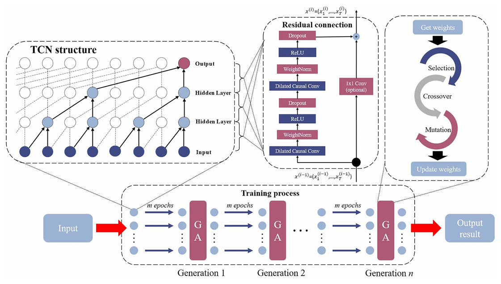

# TCN-GWAO: Temporal Convolutional Network with Genetic Algorithm for RUL Prediction

<div align="center">


</div>

## Overview

This project implements a **Temporal Convolutional Network (TCN)** combined with a **Genetic Algorithm with Weighted Average Optimization (GWAO)** for Remaining Useful Life (RUL) prediction on aircraft turbofan engines.

The model uses the **CMAPSS dataset** (Commercial Modular Aero-Propulsion System Simulation) to predict the remaining operational cycles of jet engines before maintenance is required.

### Key Features

- 🧠 **TCN Architecture**: Dilated temporal convolutions for efficient sequence modeling
- 🧬 **Genetic Algorithm**: Evolutionary optimization of model weights across generations
- ⚖️ **Weighted Averaging**: Intelligent combination of predictions from multiple test windows
- 📊 **Asymmetric Scoring**: S-score metric for RUL prediction evaluation
- 🔬 **Production-Ready**: Complete implementation with evaluation metrics and validation

## Paper Reference

> **"A Temporal Convolutional Network with Genetic Algorithm for Remaining Useful Life Prediction"**
>
> DOI: [10.1115/1.4064809](https://doi.org/10.1115/1.4064809)

## Dataset

The project uses the **CMAPSS Jet Engine Simulated Data** from NASA:

- **Source**: [NASA CMAPSS Dataset](https://data.nasa.gov/dataset/cmapss-jet-engine-simulated-data)
- **Description**: Comprehensive simulated degradation data from aircraft turbofan engines
- **Contents**: Sensor readings, operational settings, and failure progression indicators
- **Format**: Multiple subdatasets (FD001, FD002, FD003, FD004) with varying operating conditions

## Project Structure

```
TCN-GWAO/
├── README.md                 # Project documentation
├── LICENSE                   # MIT License
├── requirements.txt          # Python dependencies
├── .gitignore               # Git ignore rules
├── tcn-gawo.ipynb           # Jupyter notebook with complete implementation
├── paper/                   # Research paper and diagrams
│   ├── architecture.png     # TCN model architecture diagram
│   ├── The process diagram of TCN-GAWO.png  # Overall workflow diagram
│   └── md_146_10_101703.pdf # Published paper
└── dataset/                 # Data files (auto-ignored, download separately)
    ├── train_FD001.txt      # Training dataset
    ├── test_FD001.txt       # Test dataset
    └── RUL_FD001.txt        # True RUL values
```

## TCN-GWAO Architecture Overview

### TCN Model Architecture

<div align="center">

</div>

The Temporal Convolutional Network architecture features dilated causal convolutions with increasing dilation rates (1, 2, 4, 8), enabling the model to capture long-range temporal dependencies while maintaining computational efficiency.

### Complete Process Workflow

<div align="center">

</div>

The complete TCN-GWAO workflow illustrates the integration of data preprocessing, TCN-based feature extraction, genetic algorithm optimization, and final RUL prediction with weighted averaging across multiple test windows.

## Installation

### Prerequisites

- **Python**: 3.7 or higher
- **pip** or **conda** package manager
- **GPU** (optional, recommended for faster training)

### Quick Start

1. **Clone the repository**

```bash
git clone https://github.com/yourusername/TCN-GWAO.git
cd TCN-GWAO
```

2. **Create a virtual environment** (recommended)

```bash
# Using venv
python -m venv venv

# Activate it
# On Windows:
venv\Scripts\activate
# On macOS/Linux:
source venv/bin/activate
```

3. **Install dependencies**

```bash
pip install -r requirements.txt
```

4. **Download the CMAPSS dataset**

Download from [NASA CMAPSS Dataset](https://data.nasa.gov/dataset/cmapss-jet-engine-simulated-data) and extract to:

```
TCN-GWAO/dataset/
├── train_FD001.txt
├── test_FD001.txt
└── RUL_FD001.txt
```

## Usage

### Running the Jupyter Notebook

```bash
jupyter notebook tcn-gawo.ipynb
```

This notebook contains:
- Data loading and preprocessing
- TCN model architecture definition
- Genetic algorithm implementation
- Training loop with optimization
- Model evaluation and metrics computation

### Notebook Workflow

1. **Load Data**: Imports CMAPSS FD001 dataset from `dataset/` directory
2. **Preprocess**: Applies feature engineering and Min-Max scaling
3. **Create Windows**: Generates sliding windows of temporal sequences
4. **Initialize GA**: Sets up genetic algorithm with population of TCN models
5. **Optimize**: Iterates through generations, applying selection, crossover, and mutation
6. **Evaluate**: Computes prediction metrics on test set
7. **Report**: Outputs MAE, MSE, RMSE, and S-score

## Methodology

### 1. Data Processing

- **Dataset**: CMAPSS FD001 (single operating condition and single fault mode)
- **Feature Engineering**: Drops irrelevant columns (IDs, operational settings with constant values)
- **Normalization**: Min-Max scaling to range [-1, 1] for numerical stability
- **Sequence Generation**: Sliding windows of length 10 with stride 1
- **RUL Definition**: Piecewise linear with early RUL threshold at 125 cycles

### 2. TCN Model Architecture

```
Input: [batch_size, 10, 14] (10 timesteps, 14 features)
  ↓
TCN Layer:
  - Filters: 32
  - Kernel Size: 2
  - Dilations: (1, 2, 4, 8) → receptive field of 16 timesteps
  - Padding: Causal (no future information leakage)
  - Activation: ReLU
  - Regularization: Layer Normalization + Dropout (0.05)
  - Skip Connections: Enabled
  ↓
Dense Layer: 1 unit (RUL prediction)
  ↓
Output: Predicted RUL (scalar)
```

**Loss Function**: Mean Squared Error (MSE)
**Optimizer**: Adam (learning rate: 0.0005)

### 3. Genetic Algorithm Optimization (GWAO)

The GA evolves the TCN model weights over multiple generations:

| Parameter | Value | Description |
|-----------|-------|-------------|
| Population Size | 25 | Number of TCN models per generation |
| Generations | 10 | Number of evolutionary iterations |
| Epochs per Individual | 4 | Training epochs per model evaluation |
| Selection Method | Roulette Wheel | Probability weighted by fitness (1/RMSE) |
| Crossover Rate | 50% | Probability of uniform crossover between parents |
| Mutation Rate | 10% | Probability of weight perturbation (×0.9) |
| Fitness Function | 1/RMSE | Inverse of Root Mean Squared Error |

**GA Workflow**:
1. Initialize population with 25 random TCN models
2. Evaluate fitness of each individual
3. Select parents using roulette wheel selection
4. Apply crossover and mutation to create offspring
5. Train offspring for 4 epochs
6. Replace population with offspring
7. Repeat steps 2-6 for 10 generations
8. Select best model from final generation

### 4. Evaluation Metrics

- **MAE** (Mean Absolute Error): Average absolute prediction error
- **MSE** (Mean Squared Error): Average squared prediction error
- **RMSE** (Root Mean Squared Error): Primary optimization metric
- **S-score**: Asymmetric scoring function for RUL prediction

**S-score Formula**:
```
s = Σ exp(-d_i/13) - 1    if d_i < 0 (early prediction)
s = Σ exp(d_i/10) - 1     if d_i ≥ 0 (late prediction)
```
where `d_i = predicted_RUL_i - true_RUL_i`

The S-score penalizes late predictions more heavily than early ones, reflecting the higher cost of unexpected failures.

## Key Features

✨ **Advanced Architecture**
- Dilated convolutions capture long-range dependencies without pooling
- Causal padding ensures no information leakage from future timesteps
- Skip connections facilitate gradient flow in deep networks

🧬 **Evolutionary Optimization**
- Population-based search for better model weights
- Adaptive fitness-based selection
- Genetic operators (crossover, mutation) for exploration and exploitation

⚖️ **Intelligent Prediction Aggregation**
- Weighted averaging of multiple test window predictions
- Accounts for varying numbers of windows per engine
- Reduces variance in final predictions

📊 **Rigorous Evaluation**
- Asymmetric S-score metric reflecting real-world costs
- Multiple error metrics (MAE, MSE, RMSE)
- Separate metrics for full and last-example-only predictions

## Configuration Parameters

Key parameters in `tcn-gawo.ipynb` that can be tuned:

| Parameter | Default | Range | Purpose |
|-----------|---------|-------|---------|
| `window_length` | 10 | 5-30 | Temporal sequence length |
| `shift` | 1 | 1-5 | Stride for sliding windows |
| `early_rul` | 125 | 50-200 | RUL threshold for linear portion |
| `pop_size` | 25 | 10-50 | GA population size |
| `num_generations` | 10 | 5-30 | Number of GA iterations |
| `mutation_rate` | 0.1 | 0.05-0.3 | GA mutation probability |
| `parent_selection_pressure` | 0.5 | 0.3-0.7 | GA crossover probability |
| `batch_size` | 16 | 8-32 | Training batch size |
| `epochs` | 4 | 1-10 | Epochs per GA individual |

## Results and Performance

The model evaluates performance on the test set using:

- **Per-Engine Averaging**: Predictions are weighted by the number of test windows for each engine
- **Multiple Metrics**: Both full-window predictions and last-example-only are reported
- **S-score Evaluation**: Asymmetric penalty function reflecting maintenance cost implications

### Expected Output

After completing the GA optimization, the model outputs:

```
MAE:  ±X.XX
MSE:  X.XX
RMSE: X.XX
RMSE (Taking only last examples): X.XX
S-score: X.XX
```

## Requirements and Dependencies

**Core Libraries**
- `tensorflow>=2.10.0` - Deep learning framework
- `keras-tcn>=3.5.0` - Temporal Convolutional Network layer
- `scikit-learn>=1.0.0` - Preprocessing and metrics
- `pandas>=1.3.0` - Data manipulation
- `numpy>=1.21.0` - Numerical computing
- `matplotlib>=3.4.0` - Visualization
- `jupyter>=1.0.0` - Interactive notebooks

All dependencies are listed in `requirements.txt`

## Important Notes

- **TensorFlow Version**: Uses TensorFlow 2.x with Keras API
- **Stochastic Nature**: Results may vary due to random initialization and GA stochasticity
- **Computational Cost**: GA requires training 25 × 10 = 250 models; GPU acceleration recommended
- **Memory Usage**: Batch processing of entire test set for efficiency
- **Reproducibility**: Set random seeds (numpy, TensorFlow) for reproducible results
- **Dataset Size**: Ensure sufficient memory for large datasets; modify batch size if needed

## Troubleshooting

### Memory Issues
- Reduce `pop_size` or `batch_size` if running out of memory
- Use `tf.keras.mixed_precision` for reduced precision training
- Process data in smaller chunks

### Training Too Slow
- Enable GPU: Install CUDA and cuDNN, ensure TensorFlow detects GPU
- Reduce `epochs` per GA individual for faster iteration
- Use smaller `pop_size` for quicker GA convergence

### Poor Performance
- Verify dataset is correctly placed in `dataset/` directory
- Check data preprocessing matches notebook assumptions
- Try different `early_rul` threshold values
- Increase `num_generations` for more GA iterations

## Citation

If you use this code or method in your research, please cite:

```bibtex
@article{tcn_gwao_2024,
  title={A Temporal Convolutional Network with Genetic Algorithm for Remaining Useful Life Prediction},
  author={[Authors]},
  journal={[Journal Name]},
  year={2024},
  doi={10.1115/1.4064809},
  url={https://doi.org/10.1115/1.4064809}
}
```

**Dataset Citation**:
```bibtex
@dataset{cmapss_dataset,
  title={CMAPSS Jet Engine Simulated Data},
  author={NASA Ames Research Center},
  publisher={NASA},
  url={https://data.nasa.gov/dataset/cmapss-jet-engine-simulated-data}
}
```

## License

This project is licensed under the MIT License - see the [LICENSE](LICENSE) file for details.

## Contributing

Contributions are welcome! Here's how you can help:

1. Fork the repository
2. Create a feature branch (`git checkout -b feature/improvement`)
3. Commit your changes (`git commit -am 'Add new feature'`)
4. Push to the branch (`git push origin feature/improvement`)
5. Open a Pull Request

Please ensure your code follows the existing style and includes appropriate comments.

## Acknowledgments

- NASA for providing the CMAPSS dataset
- TensorFlow and Keras teams for the deep learning framework
- keras-tcn library for TCN implementation
- The scientific community for ongoing research in predictive maintenance

## Contact

For questions, suggestions, or issues:

- Open an issue on [GitHub Issues](https://github.com/yourusername/TCN-GWAO/issues)
- Pull requests are always welcome

---

<div align="center">

**Last Updated**: February 2026

Made with ❤️ for predictive maintenance research

[⬆ Back to Top](#tcn-gwao-temporal-convolutional-network-with-genetic-algorithm-for-rul-prediction)

</div>
